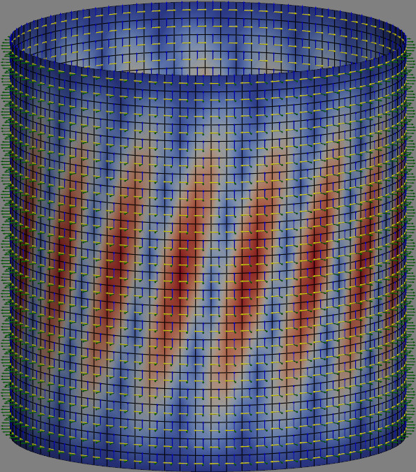

Linear buckling analysis of a cylinder under torsion
----------------------------------------------------

The figure below shows the first linear buckling mode of a cylindrical shell
under torsion. Note that the local coordinates of each element are also
plotted, all using PyVista. The figure was generated using ``refinement=2`` and
running the script directly.

The code used to generate this figure is extracted from one of ``pyfe3d`` unit
tests:

.. literalinclude:: ../../tests/test_quad4_linear_buckling_cylinder_Nxy.py
    :encoding: latin-1

