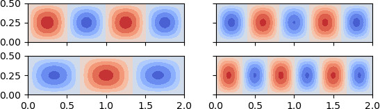

Linear buckling analysis of a plate
-----------------------------------

Here wee see the first 4 buckling modes of a simply supported plate, generated
using ``refinement=3`` in the script.

The linear buckling eigenvalue analysis is performed from the fundamental state
calculated after a static analysis.  The code used to generate this figure is
extracted from one of ``pyfe3d`` unit tests:

.. literalinclude:: ../../tests/test_quad4r_linear_buckling_plate.py
    :encoding: latin-1

