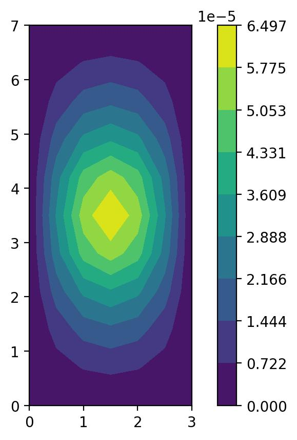

Linear static analysis
----------------------

The figure below shows the normal displacement of a simply supported plate with
a point load applied to it.

The code used to generate this figure is extracted from one of ``pyfe3d`` unit
tests:

.. literalinclude:: ../../tests/test_quad4_static_point_load.py
    :encoding: latin-1

